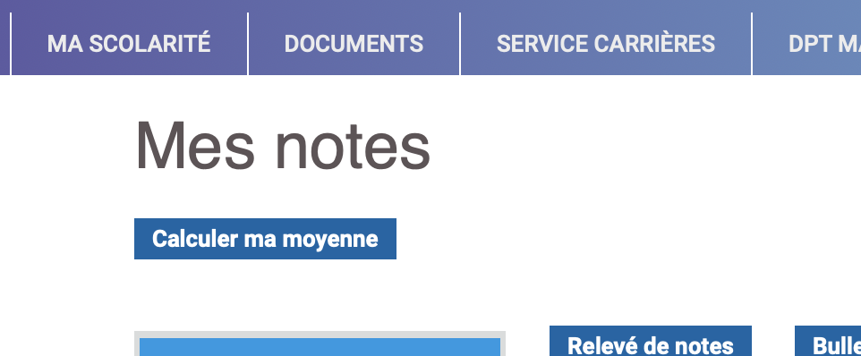

# ESO_moyenne
A userscript to know your average score.

## English : 
to use it, simply install a userscript executor on your browser. 

*You can use [TamperMonkey](https://www.tampermonkey.net/index.php?browser=chrome) on Chrome and Firefox or [Userscripts](https://apps.apple.com/fr/app/userscripts/id1463298887) on Safari.*

And add the [userscript](./userscript.js) to your local script.

## French :
pour l'utiliser, il suffit d'installer un exécuteur de userscript sur votre navigateur.

*Vous pouvez utiliser [TamperMonkey](https://www.tampermonkey.net/index.php?browser=chrome) sur Chrome et Firefox ou [Userscripts](https://apps.apple.com/fr/app/userscripts/id1463298887) sur Safari.*

Et ajoutez le [userscript](./userscript.js) à votre script local.

## Contributor : 
This script as been written by [Matthieu Ev](https://github.com/matthieuEv) and myself for our personal use.

Ce script a été écrit par [Matthieu Ev](https://github.com/matthieuEv) et moi-même pour notre usage personnel.
